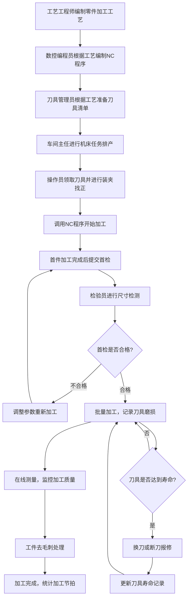

## 1. 产品概述

数控机床车间机加工业务管理后台，用于机加车间管理程序、刀具和工件，实现数字化、智能化的生产管理闭环。

- 核心目的：通过数字化手段管理机加工全流程，涵盖从工艺设计到成品检验的完整业务链，提升生产效率、降低刀具损耗、确保加工质量
- 解决问题：传统车间管理依赖人工记录，存在信息断层、刀具管理混乱、排产效率低、质量追溯困难等痛点
- 目标用户：车间主任、工艺工程师、数控编程员、刀具管理员、机床操作员、质量检验员
- 产品价值：实现生产数据实时采集、智能排产、刀具全生命周期管理、质量追溯分析，帮助车间降本增效

## 2. 核心特性

### 2.1 用户角色

| 角色 | 注册方式 | 核心权限 |
|------|----------|----------|
| 车间主任 | 管理员创建 | 全局数据查看、排产审批、报表统计、系统配置 |
| 工艺工程师 | 管理员创建 | 图纸工艺管理、零件加工工艺编制 |
| 数控编程员 | 管理员创建 | 数控程序编制、程序版本管理 |
| 刀具管理员 | 管理员创建 | 刀具入库、领用、归还、寿命管理、报修登记 |
| 机床操作员 | 管理员创建 | 加工作业执行、装夹找正记录、在线测量、工件去毛刺 |
| 质量检验员 | 管理员创建 | 首件检验、尺寸检测数据录入、质量判定 |

### 2.2 功能模块

1. **图纸工艺**：零件加工工艺管理、工艺路线设计、工序参数配置
2. **程序编制**：数控程序编制、程序版本管理、程序仿真预览、程序下发
3. **刀具管理**：刀具台账、刀具清单领用、刀具补偿设置、刀具库存预警
4. **机床排产**：机床任务排产、甘特图可视化、产能分析、任务调度
5. **加工作业**：装夹找正记录、加工作业执行、工件去毛刺、加工进度追踪
6. **首件检验**：加工尺寸首检、在线测量数据、质量判定、检验报告
7. **刀具寿命**：刀具磨损记录、断刀报修登记、寿命预测、换刀提醒

### 2.3 页面详情

| 页面名称 | 模块名称 | 功能描述 |
|----------|----------|----------|
| 仪表板 | 数据概览 | 关键指标卡片、今日任务概览、机床状态监控、告警通知 |
| 图纸工艺 | 零件加工工艺 | 工艺列表、工艺详情、工序编辑、参数配置、工艺版本管理 |
| 程序编制 | 数控程序编制 | 程序编辑器、程序上传、版本对比、程序下发记录、仿真预览 |
| 刀具管理 | 刀具清单领用 | 刀具台账、领用申请、审批流程、归还登记、库存管理 |
| 刀具补偿 | 刀具补偿设置 | 补偿参数配置、补偿值调整、补偿历史记录、补偿生效验证 |
| 机床排产 | 机床任务排产 | 甘特图排产、任务拖拽调度、产能负载分析、冲突检测 |
| 加工作业 | 装夹找正记录 | 装夹方案、找正数据、夹具管理、装夹时间统计 |
| 加工作业 | 工件去毛刺 | 去毛刺任务列表、作业记录、质量检查、工时统计 |
| 首件检验 | 加工尺寸首检 | 检验项配置、测量数据录入、公差判定、检验报告生成 |
| 首件检验 | 在线测量数据 | 实时测量数据展示、趋势图表、超差预警、数据导出 |
| 刀具寿命 | 刀具磨损记录 | 磨损量采集、磨损趋势分析、磨损等级评估 |
| 刀具寿命 | 断刀报修登记 | 报修单填写、原因分析、维修记录、费用统计 |
| 统计分析 | 加工节拍统计 | 节拍数据分析、瓶颈工序识别、效率优化建议 |

## 3. 核心流程

## 4. 用户界面设计

### 4.1 设计风格

- **主色调**：工业蓝 `#165DFF`，代表专业、可靠、技术感
- **辅助色**：深灰 `#1D2129`、中灰 `#4E5969`、浅灰 `#C9CDD4`
- **强调色**：橙色 `#FF7D00`（告警/预警）、绿色 `#00B42A`（正常/合格）、红色 `#F53F3F`（异常/不合格）
- **按钮风格**：直角或微圆角（2px），扁平设计，边框清晰，体现工业硬朗风格
- **字体**：中文使用「思源黑体」，数字和英文使用「JetBrains Mono」等宽字体，确保数据可读性
- **字号层级**：标题18-20px、副标题15-16px、正文14px、辅助文字12px、数据展示13-16px（等宽字体）
- **布局风格**：左侧导航栏+顶部工具栏+主内容区，卡片式模块布局，表格为核心展示形式
- **图标风格**：线性图标，简洁工业风，避免过于可爱或圆润的图标

### 4.2 页面设计概览

| 页面名称 | 模块名称 | UI元素 |
|----------|----------|--------|
| 仪表板 | 数据概览 | 数据卡片网格、状态指示灯、小型折线图/柱状图、告警列表、快速操作区 |
| 图纸工艺 | 零件加工工艺 | 左侧零件树、右侧工艺详情Tab页、工序卡片、参数表格、版本时间线 |
| 程序编制 | 数控程序编制 | 代码编辑器（行号高亮）、工具栏、文件目录树、版本对比面板、仿真窗口 |
| 刀具管理 | 刀具清单领用 | 刀具分类筛选、数据表格、领用弹窗、审批流程条、库存预警标签 |
| 刀具补偿 | 刀具补偿设置 | 刀具选择器、补偿参数表单、补偿值滑块、历史记录折线图 |
| 机床排产 | 机床任务排产 | 甘特图（时间轴+机床行）、任务卡片、负载率热力图、调度操作工具栏 |
| 加工作业 | 装夹找正记录 | 装夹示意图、找正数据表格、夹具选择器、时间记录面板 |
| 首件检验 | 加工尺寸首检 | 检验项列表、测量输入框、公差带可视化、合格/不合格状态标识 |
| 首件检验 | 在线测量数据 | 实时数据看板、趋势曲线图、超差高亮、数据导出按钮 |
| 刀具寿命 | 刀具磨损记录 | 磨损趋势图、磨损等级色阶、换刀提醒标记 |
| 刀具寿命 | 断刀报修登记 | 报修表单、原因选择器、图片上传区、维修状态时间线 |
| 统计分析 | 加工节拍统计 | 节拍柱状图、对比分析图、瓶颈标识、统计报表 |

### 4.3 响应式设计

- **设计优先级**：桌面端优先（1920x1080为标准设计尺寸），主要面向车间办公电脑和工业一体机
- **大屏适配**：支持2K/4K大屏展示，数据看板可自适应缩放
- **平板适配**：侧边栏可折叠，表格支持横向滚动
- **触控优化**：重要操作按钮尺寸不小于44x44px，支持触控操作
- **最小支持分辨率**：1366x768

### 4.4 工业风格视觉细节

- **数据呈现**：关键数据使用大字号等宽字体，配合红绿状态色
- **表格设计**：斑马纹、表头冻结、选中行高亮、支持列宽拖拽
- **状态指示**：使用圆形指示灯（亮/灭/闪烁三种状态）表示设备运行状态
- **边框风格**：1px实线边框，分割清晰，避免过多阴影
- **进度展示**：线性进度条，分段式展示工序完成度
- **告警展示**：顶部通知条+桌面通知+声音提示（可选）三级告警机制
