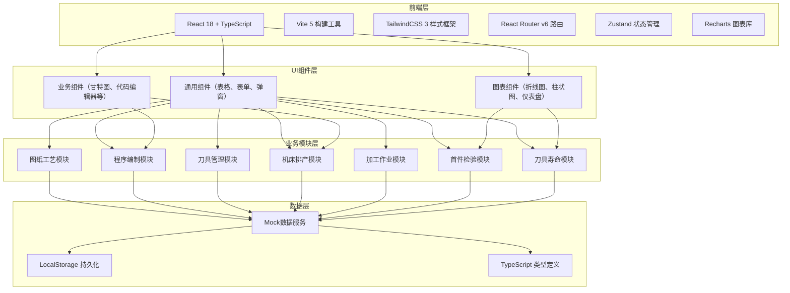
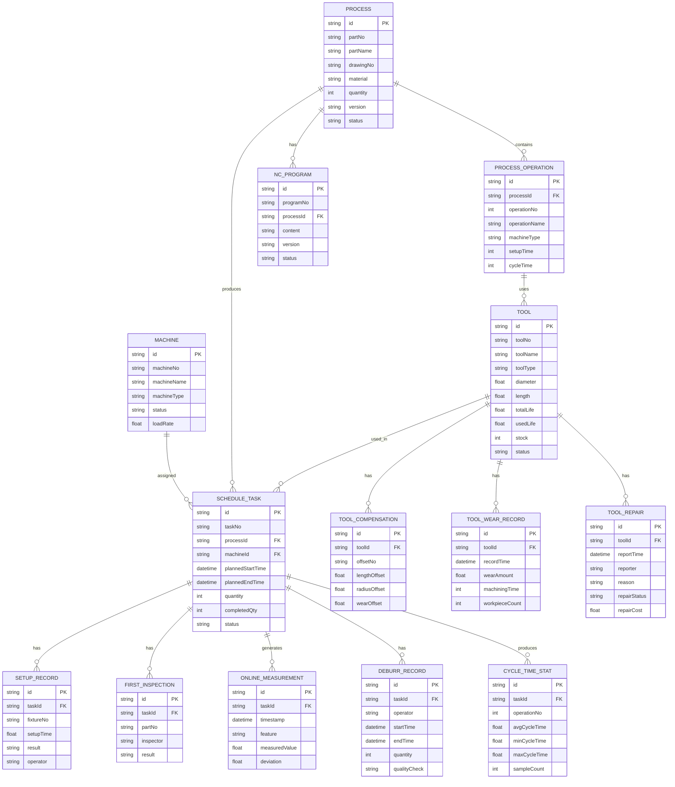

## 1. 架构设计



## 2. 技术描述

- **前端框架**：React@18.2 + TypeScript@5.4
- **构建工具**：Vite@5.2
- **样式方案**：TailwindCSS@3.4 + PostCSS@8.4
- **路由管理**：React Router DOM@6.23
- **状态管理**：Zustand@4.5（轻量级状态管理，替代Redux）
- **图表库**：Recharts@2.12（React生态友好的图表库）
- **图标库**：Lucide React@0.379（线性工业风图标）
- **UI组件基础**：自行封装工业风格组件（不使用Ant Design等通用组件库，确保风格统一）
- **代码编辑器**：@uiw/react-codemirror@4.22（用于NC程序编辑）
- **日期处理**：date-fns@3.6
- **后端**：无，使用前端Mock数据 + LocalStorage持久化
- **数据库**：LocalStorage（浏览器本地存储）

## 3. 路由定义

| 路由路径 | 页面名称 | 模块归属 |
|----------|----------|----------|
| `/` | 仪表板 | 数据概览 |
| `/process` | 图纸工艺列表 | 图纸工艺 |
| `/process/:id` | 工艺详情 | 图纸工艺 |
| `/program` | 程序编制列表 | 程序编制 |
| `/program/:id` | 程序编辑器 | 程序编制 |
| `/tool` | 刀具清单领用 | 刀具管理 |
| `/tool/compensation` | 刀具补偿设置 | 刀具管理 |
| `/schedule` | 机床任务排产 | 机床排产 |
| `/operation` | 加工作业列表 | 加工作业 |
| `/operation/setup` | 装夹找正记录 | 加工作业 |
| `/operation/deburr` | 工件去毛刺 | 加工作业 |
| `/inspection` | 首件检验列表 | 首件检验 |
| `/inspection/first` | 加工尺寸首检 | 首件检验 |
| `/inspection/online` | 在线测量数据 | 首件检验 |
| `/tool-life` | 刀具寿命总览 | 刀具寿命 |
| `/tool-life/wear` | 刀具磨损记录 | 刀具寿命 |
| `/tool-life/repair` | 断刀报修登记 | 刀具寿命 |
| `/statistics` | 加工节拍统计 | 统计分析 |

## 4. API 接口定义（Mock）

### 4.1 通用响应结构

```typescript
interface ApiResponse<T> {
  code: number;
  message: string;
  data: T;
  timestamp: number;
}
```

### 4.2 核心数据类型

```typescript
// 零件工艺
interface Process {
  id: string;
  partNo: string;
  partName: string;
  drawingNo: string;
  material: string;
  quantity: number;
  operations: ProcessOperation[];
  version: string;
  status: 'draft' | 'approved' | 'obsolete';
  createTime: string;
  updateTime: string;
}

interface ProcessOperation {
  id: string;
  operationNo: number;
  operationName: string;
  machineType: string;
  toolList: string[];
  parameters: ProcessParameter[];
  setupTime: number;
  cycleTime: number;
}

interface ProcessParameter {
  name: string;
  value: string;
  unit: string;
}

// 数控程序
interface NCProgram {
  id: string;
  programNo: string;
  programName: string;
  processId: string;
  machineType: string;
  content: string;
  version: string;
  status: 'draft' | 'verified' | 'released';
  createTime: string;
  updateTime: string;
}

// 刀具
interface Tool {
  id: string;
  toolNo: string;
  toolName: string;
  toolType: 'endmill' | 'drill' | 'turning' | 'boring' | 'other';
  diameter: number;
  length: number;
  material: string;
  manufacturer: string;
  totalLife: number;
  usedLife: number;
  status: 'available' | 'in_use' | 'worn' | 'broken';
  stock: number;
  minStock: number;
}

// 刀具补偿
interface ToolCompensation {
  id: string;
  toolId: string;
  offsetNo: string;
  lengthOffset: number;
  radiusOffset: number;
  wearOffset: number;
  effectiveDate: string;
  operator: string;
}

// 机床
interface Machine {
  id: string;
  machineNo: string;
  machineName: string;
  machineType: string;
  status: 'idle' | 'running' | 'maintenance' | 'error';
  currentTaskId?: string;
  loadRate: number;
}

// 排产任务
interface ScheduleTask {
  id: string;
  taskNo: string;
  processId: string;
  machineId: string;
  plannedStartTime: string;
  plannedEndTime: string;
  actualStartTime?: string;
  actualEndTime?: string;
  quantity: number;
  completedQty: number;
  status: 'pending' | 'in_progress' | 'completed' | 'paused';
}

// 装夹找正记录
interface SetupRecord {
  id: string;
  taskId: string;
  machineId: string;
  fixtureNo: string;
  alignmentData: AlignmentPoint[];
  operator: string;
  setupTime: number;
  result: 'pass' | 'fail';
  createTime: string;
}

interface AlignmentPoint {
  pointName: string;
  x: number;
  y: number;
  z: number;
  deviation: number;
}

// 首件检验
interface FirstInspection {
  id: string;
  taskId: string;
  partNo: string;
  inspector: string;
  inspectionItems: InspectionItem[];
  result: 'pass' | 'fail';
  createTime: string;
}

interface InspectionItem {
  id: string;
  featureName: string;
  nominal: number;
  upperTolerance: number;
  lowerTolerance: number;
  measuredValue: number;
  result: 'pass' | 'fail';
}

// 在线测量数据
interface OnlineMeasurement {
  id: string;
  taskId: string;
  timestamp: string;
  feature: string;
  measuredValue: number;
  deviation: number;
  temperature?: number;
}

// 刀具磨损记录
interface ToolWearRecord {
  id: string;
  toolId: string;
  recordTime: string;
  wearAmount: number;
  machiningTime: number;
  workpieceCount: number;
}

// 断刀报修
interface ToolRepair {
  id: string;
  toolId: string;
  taskId?: string;
  reportTime: string;
  reporter: string;
  reason: string;
  repairStatus: 'pending' | 'repairing' | 'repaired' | 'scrapped';
  repairCost?: number;
  repairTime?: string;
}

// 去毛刺记录
interface DeburrRecord {
  id: string;
  taskId: string;
  operator: string;
  startTime: string;
  endTime: string;
  quantity: number;
  qualityCheck: 'pass' | 'fail';
  remark?: string;
}

// 加工节拍统计
interface CycleTimeStat {
  id: string;
  taskId: string;
  operationNo: number;
  partNo: string;
  avgCycleTime: number;
  minCycleTime: number;
  maxCycleTime: number;
  sampleCount: number;
  date: string;
}
```

## 5. 数据模型 ER 图



## 6. 项目目录结构

```
src/
├── assets/              # 静态资源（字体、图片）
├── components/          # 通用组件
│   ├── layout/         # 布局组件（侧边栏、顶部栏）
│   ├── ui/             # 基础UI组件（按钮、输入框、表格等）
│   ├── charts/         # 图表组件
│   └── business/       # 业务组件（甘特图、代码编辑器等）
├── pages/              # 页面组件
│   ├── dashboard/
│   ├── process/
│   ├── program/
│   ├── tool/
│   ├── schedule/
│   ├── operation/
│   ├── inspection/
│   ├── tool-life/
│   └── statistics/
├── store/              # Zustand状态管理
│   ├── useProcessStore.ts
│   ├── useProgramStore.ts
│   ├── useToolStore.ts
│   └── ...
├── mock/               # Mock数据
│   ├── data/           # 模拟数据
│   └── services/       # 模拟API服务
├── types/              # TypeScript类型定义
│   ├── index.ts
│   ├── process.ts
│   ├── tool.ts
│   └── ...
├── utils/              # 工具函数
│   ├── format.ts       # 格式化函数
│   ├── date.ts         # 日期处理
│   └── storage.ts      # LocalStorage封装
├── router/             # 路由配置
│   └── index.tsx
├── App.tsx
├── main.tsx
└── index.css           # 全局样式 + Tailwind指令
```

## 7. 前端性能优化策略

1. **代码分割**：按路由进行代码分割，首屏只加载仪表板相关代码
2. **虚拟滚动**：数据表格使用虚拟滚动，支持10000+条数据流畅展示
3. **Memo优化**：对频繁渲染的表格行、图表组件使用React.memo
4. **状态合理划分**：使用Zustand进行细粒度状态订阅，避免不必要重渲染
5. **图表懒加载**：统计图表组件按需加载Recharts库
6. **LocalStorage缓存**：对不经常变化的基础数据进行本地缓存
7. **防抖节流**：搜索框、测量数据输入等使用防抖优化
